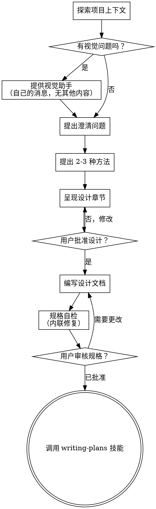

# 将想法 brainstorming 成设计

通过自然协作对话帮助将想法转化为完全形成的设计和规格。

首先了解当前项目上下文，然后一次一个地提问来完善想法。一旦理解了你正在构建的内容，呈现设计并获得用户批准。

<HARD-GATE>
在呈现设计并获得用户批准之前，**不要**调用任何实施技能、编写任何代码、搭建任何项目或采取任何实施行动。这适用于**每个**项目，无论感知到的简单性如何。
</HARD-GATE>

## 反模式："这太简单了，不需要设计"

每个项目都要经过这个过程。待办事项列表、单功能实用程序、配置更改——所有这些。"简单"项目是未检查的假设造成最多浪费工作的地方。设计可以是短的（对于真正简单的项目只需几句话），但你**必须**呈现它并获得批准。

## 检查清单

你**必须**为每个项目创建一个任务并按顺序完成：

1. **探索项目上下文** — 检查文件、文档、最近的提交
2. **提供视觉助手**（如果主题涉及视觉问题）— 这是它自己的消息，不要与澄清问题合并。请参阅下面的视觉助手部分。
3. **提出澄清问题** — 一次一个，了解目的/约束/成功标准
4. **提出 2-3 种方法** — 带有权衡和你的建议
5. **呈现设计** — 按复杂性缩放每个章节，在每个章节后获得用户批准
6. **编写设计文档** — 保存到 `docs/superpowers/specs/YYYY-MM-DD-<topic>-design.md` 并提交
7. **规格自检** — 快速内联检查占位符、矛盾、歧义、范围（见下文）
8. **用户审核书面规格** — 要求用户在继续之前审核规格文件
9. **过渡到实施** — 调用 writing-plans 技能创建实施计划

## 流程图

**终止状态是调用 writing-plans。** 不要调用 frontend-design、mcp-builder 或任何其他实施技能。brainstorming 后唯一调用的技能是 writing-plans。

## 这个过程

**理解想法：**

- 首先检查当前项目状态（文件、文档、最近的提交）
- 在问详细问题之前，评估范围：如果请求描述多个独立子系统（例如，"构建一个包含聊天、文件存储、计费和分析的平台"），立即标记这一点。不要花时间完善一个需要首先分解的项目细节。
- 如果项目太大无法包含在单个规格中，帮助用户分解为子项目：独立的 pieces 是什么，它们如何关联，应该按什么顺序构建？然后通过正常的设计流程进行第一个子项目的头脑风暴。每个子项目有自己的规格 → 计划 → 实施周期。
- 对于适当范围的项目，一次一个地提问来完善想法
- 尽可能使用多项选择问题，但开放也可以
- 每条消息一个问题——如果一个主题需要更多探索，将其分成多个问题
- 重点理解：目的、约束、成功标准

**探索方法：**

- 提出 2-3 种不同的方法并权衡利弊
- 用你的建议和理由对话式地呈现选项
- 以你推荐的选项开头并解释原因

**呈现设计：**

- 一旦你相信理解了要构建什么，就呈现设计
- 根据复杂性缩放每个章节：如果直接则几句话，如果细微则最多 200-300 字
- 在每个章节后询问到目前为止是否看起来正确
- 涵盖：架构、组件、数据流、错误处理、测试
- 准备好回来澄清如果有什么不合理的地方

**为隔离和清晰度设计：**

- 将系统分解为更小的单元，每个单元有一个清晰的目的，通过定义良好的接口通信，可以独立理解和测试
- 对于每个单元，你应该能够回答：它做什么，你怎么使用它，它依赖什么？
- 有人能在不阅读内部实现的情况下理解一个单元做什么吗？你能改变内部实现而不破坏消费者吗？如果不能，边界需要改进。
- 更小、边界良好的单元也更容易与你合作——你更好地推理能够一次性掌握的代码，当文件专注时你的编辑更可靠。当一个文件变大时，这通常是它做得太多的信号。

**在现有代码库中工作：**

- 在提出更改之前探索当前结构。遵循现有模式。
- 如果现有代码有问题影响工作（例如，一个变得太大的文件、不清楚的边界、纠缠的职责），将有针对性的改进作为设计的一部分——就像一个好的开发者在他们工作的代码中改进代码一样。
- 不要提出无关的重构。专注于为当前目标服务的内容。

## 设计之后

**文档：**

- 将验证的设计（规格）写入 `docs/superpowers/specs/YYYY-MM-DD-<topic>-design.md`
  -（用户对规格位置的偏好覆盖此默认值）
- 如果有 elements-of-style:writing-clearly-and-concisely 技能则使用它
- 将设计文档提交到 git

**规格自检：**
编写规格文档后，用新的眼光看待它：

1. **占位符扫描：** 任何"TBD"、"TODO"、不完整的部分或模糊的要求？修复它们。
2. **内部一致性：** 任何部分相互矛盾吗？架构与功能描述匹配吗？
3. **范围检查：** 这对于单个实施计划是否足够集中，还是需要分解？
4. **歧义检查：** 任何要求可以有两种不同的解释吗？如果是这样，选择一个并使其明确。

内联修复任何问题。不需要重新审查——只需修复并继续。

**用户审核门：**
规格审查循环通过后，要求用户在继续之前审核书面规格：

> "规格已写入并提交到 `<path>`。请审核它，并告诉我是否想在开始编写实施计划之前做任何更改。"

等待用户的响应。如果他们请求更改，进行更改并重新运行规格审查循环。只有在用户批准后才能继续。

**实施：**

- 调用 writing-plans 技能创建详细的实施计划
- 不要调用任何其他技能。writing-plans 是下一步。

## 关键原则

- **一次一个问题** - 不要用多个问题淹没用户
- **多项选择首选** - 比开放问题更容易回答
- **无情地 YAGNI** - 从所有设计中删除不必要的功能
- **探索替代方案** - 在确定之前总是提出 2-3 种方法
- **增量验证** - 呈现设计，获得批准后再继续
- **保持灵活** - 当某些事情不合理时回来澄清

## 视觉助手

一个基于浏览器的伴侣，用于在头脑风暴期间显示模型、图表和视觉选项。作为工具可用——不是一种模式。接受伴侣意味着它可用于受益于视觉处理的问题；它**不**意味着每个问题都通过浏览器。

**提供伴侣：** 当你预计即将到来的问题将涉及视觉内容（模型、布局、图表）时，提供一次以获得同意：
> "如果我们能在网页浏览器中向您展示一些东西，可能更容易解释。我可以在我们进行时组合模型、图表、比较和其他视觉效果。这个功能仍然是新的，可能会消耗大量 tokens。想试试吗？（需要打开本地 URL）"

**这个提议必须是它自己的消息。** 不要将其与澄清问题、上下文摘要或任何其他内容合并。消息应仅包含上述提议，别无其他。等待用户的响应后再继续。如果他们拒绝，继续纯文本头脑风暴。

**每个问题的决定：** 即使用户接受了，也要为**每个问题**决定是使用浏览器还是终端。测试：**用户通过看它比读它更好地理解吗？**

- **使用浏览器**用于本来就是视觉的内容——模型、线框、布局比较、架构图、并排视觉设计
- **使用终端**用于文本内容——需求问题、概念选择、权衡列表、A/B/C/D 文本选项、范围决策

关于 UI 主题的问题不自动是视觉问题。"在这个上下文中，个性意味着什么？"是一个概念问题——使用终端。"哪个向导布局更好？"是一个视觉问题——使用浏览器。

如果他们同意伴侣，在继续之前阅读详细指南：
`skills/brainstorming/visual-companion.md`