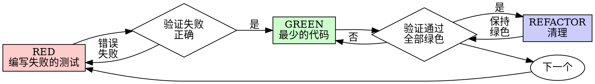

# 测试驱动开发 (TDD)

## 概述

先写测试。看着它失败。编写最少的代码让它通过。

**核心原则：** 如果你没有看着测试失败，你就不知道它是否测试了正确的东西。

**违反规则的文字就是违反规则的精神。**

## 何时使用

**始终：**
- 新功能
- Bug 修复
- 重构
- 行为变更

**例外（询问你的合作伙伴）：**
- 一次性原型
- 生成代码
- 配置文件

认为"这次跳过 TDD"？停止。这是合理化。

## 铁律

```
在没有首先失败测试的情况下，不要写生产代码
```

在测试之前写代码？删除它。重新开始。

**没有例外：**
- 不要保留它作为"参考"
- 不要在写测试时"改编"它
- 不要看它
- 删除意味着删除

根据测试重新开始。就是这样。

## 红-绿-重构



### RED - 编写失败的测试

写一个最少的测试显示应该发生什么。

<Good>
```typescript
test('重试失败的操作3次', async () => {
  let attempts = 0;
  const operation = () => {
    attempts++;
    if (attempts < 3) throw new Error('fail');
    return 'success';
  };

  const result = await retryOperation(operation);

  expect(result).toBe('success');
  expect(attempts).toBe(3);
});
```
清晰的名称，测试真实行为，一件事
</Good>

<Bad>
```typescript
test('重试工作', async () => {
  const mock = jest.fn()
    .mockRejectedValueOnce(new Error())
    .mockRejectedValueOnce(new Error())
    .mockResolvedValueOnce('success');
  await retryOperation(mock);
  expect(mock).toHaveBeenCalledTimes(3);
});
```
模糊的名称，测试 mock 而不是代码
</Bad>

**要求：**
- 一个行为
- 清晰的名称
- 真实的代码（除非不可避免，否则不使用 mock）

### 验证 RED - 看着它失败

**强制。永远不要跳过。**

```bash
npm test path/to/test.test.ts
```

确认：
- 测试失败（不是错误）
- 失败消息是预期的
- 因为功能缺失而失败（不是拼写错误）

**测试通过？** 你在测试现有行为。修复测试。

**测试错误？** 修复错误，重新运行直到正确失败。

### GREEN - 最少的代码

编写最简单的代码让测试通过。

<Good>
```typescript
async function retryOperation<T>(fn: () => Promise<T>): Promise<T> {
  for (let i = 0; i < 3; i++) {
    try {
      return await fn();
    } catch (e) {
      if (i === 2) throw e;
    }
  }
  throw new Error('unreachable');
}
```
仅仅通过
</Good>

<Bad>
```typescript
async function retryOperation<T>(
  fn: () => Promise<T>,
  options?: {
    maxRetries?: number;
    backoff?: 'linear' | 'exponential';
    onRetry?: (attempt: number) => void;
  }
): Promise<T> {
  // YAGNI
}
```
过度工程
</Bad>

不要添加功能、重构其他代码或"改进"超过测试。

### 验证 GREEN - 看着它通过

**强制。**

```bash
npm test path/to/test.test.ts
```

确认：
- 测试通过
- 其他测试仍然通过
- 输出干净（没有错误、警告）

**测试失败？** 修复代码，不是测试。

**其他测试失败？** 现在修复。

### REFACTOR - 清理

仅在绿色之后：
- 删除重复
- 改进名称
- 提取辅助函数

保持测试绿色。不要添加行为。

### 重复

下一个失败测试用于下一个功能。

## 好测试

| 质量 | 好 | 坏 |
|---------|------|-----|
| **最少** | 一件事。名称中有"and"？分开它。 | `test('validates email and domain and whitespace')` |
| **清晰** | 名称描述行为 | `test('test1')` |
| **显示意图** | 展示期望的 API | 隐藏代码应该做什么 |

## 为什么顺序重要

"我之后写测试来验证它工作"

测试编写后立即通过。立即通过不能证明什么：
- 可能测试了错误的东西
- 可能测试了实现，而不是行为
- 可能忘记了你忘记的边缘情况
- 你从未见过它捕获 bug

测试优先强制你看到测试失败，证明它实际上测试了一些东西。

"我已经手动测试了所有边缘情况"

手动测试是随意的。你认为你测试了一切但：
- 没有记录你测试了什么
- 代码更改时无法重新运行
- 在压力下容易忘记情况
- "我试的时候它工作了" ≠ 全面

自动化测试是系统化的。它们每次以相同的方式运行。

"删除 X 小时的工作是浪费"

沉没成本谬误。时间已经过去了。你现在的选择是：
- 删除并用 TDD 重写（再花 X 小时，高信心）
- 保留它并之后添加测试（30 分钟，低信心，可能有 bug）

"浪费"是保留你不能信任的代码。没有真正测试的工作代码是技术债务。

"TDD 是教条的，实用意味着适应"

TDD 是实用的：
- 在提交前发现 bug（比之后调试更快）
- 防止回归（测试立即捕获破坏）
- 记录行为（测试显示如何使用代码）
- 支持重构（自由更改，测试捕获破坏）

"实用"捷径 = 在生产中调试 = 更慢。

"之后的测试达到相同的目标——是精神而不是仪式"

不。之后的测试回答"这做什么？"测试优先回答"这应该做什么？"

之后的测试被你的实现所偏见。你测试你构建的，而不是要求的。你验证记住的边缘情况，而不是发现的。

测试优先在实施之前强制发现边缘情况。之后测试验证你记住了 everything（你没有）。

30 分钟之后的测试 ≠ TDD。你得到覆盖率，失去测试工作的证明。

## 常见合理化

| 借口 | 现实 |
|---------|---------|
| "太简单不需要测试" | 简单的代码也会坏。测试只需要 30 秒。 |
| "我之后测试" | 立即通过的测试不能证明什么。 |
| "之后的测试达到相同目标" | 之后的测试 = "这做什么？" 测试优先 = "这应该做什么？" |
| "已经手动测试过了" | 随意 ≠ 系统化。没有记录，无法重新运行。 |
| "删除 X 小时是浪费" | 沉没成本谬误。保留无法验证的代码是技术债务。 |
| "保留作为参考，先写测试" | 你会改编它。那是之后测试。删除意味着删除。 |
| "需要先探索" | 没关系。丢弃探索，从 TDD 开始。 |
| "测试难 = 设计不清楚" | 倾听测试。难测试 = 难使用。 |
| "TDD 会让我变慢" | TDD 比调试更快。实用 = 测试优先。 |
| "手动测试更快" | 手动不能证明边缘情况。每次更改你都会重新测试。 |
| "现有代码没有测试" | 你正在改进它。为现有代码添加测试。 |

## 红旗 - 停止并重新开始

- 测试之前的代码
- 实施后测试
- 测试立即通过
- 无法解释为什么测试失败
- 之后"添加"的测试
- 合理化"就这一次"
- "我已经手动测试过了"
- "之后的测试达到相同目的"
- "是关于精神而不是仪式"
- "保留作为参考"或"改编现有代码"
- "已经花了 X 小时，删除是浪费"
- "TDD 是教条的，我是实用的"
- "这不一样因为..."

**所有这些意味着：删除代码。用 TDD 重新开始。**

## 示例：Bug 修复

**Bug：** 接受空邮箱

**RED**
```typescript
test('拒绝空邮箱', async () => {
  const result = await submitForm({ email: '' });
  expect(result.error).toBe('Email required');
});
```

**验证 RED**
```bash
$ npm test
FAIL: expected 'Email required', got undefined
```

**GREEN**
```typescript
function submitForm(data: FormData) {
  if (!data.email?.trim()) {
    return { error: 'Email required' };
  }
  // ...
}
```

**验证 GREEN**
```bash
$ npm test
PASS
```

**REFACTOR**
如需要，为多个字段提取验证。

## 验证清单

在标记工作完成之前：

- [ ] 每个新函数/方法都有测试
- [ ] 在实施之前看着每个测试失败
- [ ] 每个测试因预期原因失败（功能缺失，不是拼写错误）
- [ ] 为每个测试编写最少的代码让它通过
- [ ] 所有测试通过
- [ ] 输出干净（没有错误、警告）
- [ ] 测试使用真实代码（除非不可避免，否则不使用 mock）
- [ ] 覆盖边缘情况和错误

无法勾选所有方框？你跳过了 TDD。重新开始。

## 当卡住时

| 问题 | 解决方案 |
|---------|----------|
| 不知道如何测试 | 编写期望的 API。首先编写断言。询问你的合作伙伴。 |
| 测试太复杂 | 设计太复杂。简化接口。 |
| 必须 mock 一切 | 代码太耦合。使用依赖注入。 |
| 测试设置巨大 | 提取辅助函数。还复杂？简化设计。 |

## 调试集成

发现 bug？编写重现它的失败测试。遵循 TDD 周期。测试证明修复并防止回归。

永远不要在没有测试的情况下修复 bug。

## 测试反模式

添加 mock 或测试工具时，阅读 @testing-anti-patterns.md 以避免常见陷阱：
- 测试 mock 行为而不是真实行为
- 向生产类添加仅测试的方法
- 不理解依赖就 mock

## 最终规则

```
生产代码 → 测试存在且首先失败
否则 → 不是 TDD
```

没有例外，除非你获得合作伙伴的许可。